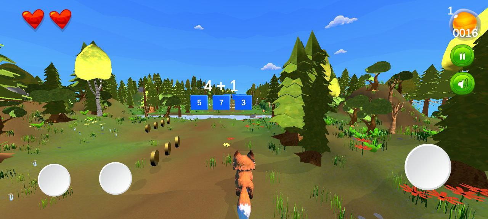
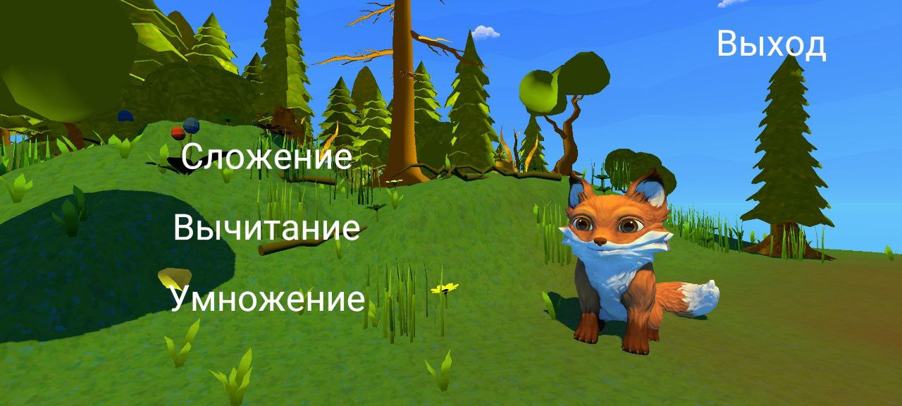

# Math Fox Runner

 

## 🦊 О проекте

Math Fox Runner - это образовательная мобильная игра для детей, созданная на Unity для платформы Android. Игра сочетает в себе увлекательный раннер с изучением таблицы сложения и умножения.

Главный герой - лисичка, которая бежит по дорожке и решает математические примеры. Игрок должен помочь лисичке выбрать правильный ответ из трех предложенных вариантов.

## 🎯 Цель проекта

Проект создавался для личного использования с целью помочь детям в игровой форме освоить базовые математические операции:
- Сложение чисел
- Вычитание
- Умножение

## 🎮 Особенности

- **Образовательный геймплей** - изучение математики через игру
- **Простой интерфейс** - интуитивно понятное управление для детей
- **Система прогресса** - постепенное усложнение примеров
- **Привлекательный персонаж** - милая лисичка как главный герой
- **Три варианта ответа** - выбор правильного решения

## 📱 Скриншоты

| Игровой процесс | Выбор ответа | Меню |
|----------------|--------------|------|
|  |  |  |

## 🛠 Технологии

- **Движок**: Unity
- **Язык программирования**: C#
- **Платформа**: Android
- **Minimum API**: Android 8.0+ (API Level 26+)
- **Target API**: Android 13.0 (API Level 33)

## 📥 Установка

1. Скачайте последний APK файл из раздела [Releases](https://github.com/YanaKudrinskaya/MathRunner/releases)
2. Установите приложение на ваше Android устройство
3. Разрешите установку из неизвестных источников (если необходимо)

## 📝 Лицензия
Это личный проект, созданный для некоммерческого использования. Распространение и модификация разрешены с указанием авторства.

## 🤝 Контакты
Если у вас есть вопросы или предложения по проекту, свяжитесь со мной:

Email: yanakudrinskaya86@yandex.ru

Telegram: @YanaKudrinskaya
 
